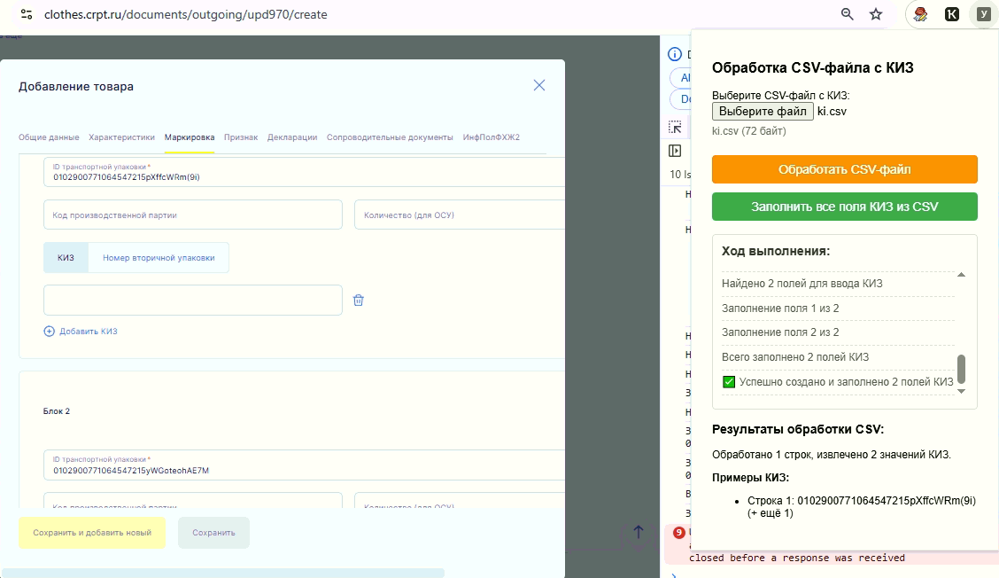

# УПД: Обработка КИЗ из CSV

Версия: 2025.04.03.13

## Описание
Расширение для браузера Chrome, предназначенное для автоматизации задач на сайте clothes.crpt.ru. Позволяет обрабатывать CSV-файлы с КИЗ-кодами и автоматически заполнять соответствующие поля на сайте.

## Скриншот


*Примечание: Замените `screenshots/interface.png` на путь к вашему скриншоту. Создайте папку `screenshots` в корне репозитория и поместите туда изображение.*

## Основные функции
- Обработка CSV-файлов с КИЗ-кодами (поддержка экранированных кавычек и запятых в значениях)
- Автоматическое создание необходимого количества полей для ввода КИЗ на сайте
- Заполнение созданных полей значениями из CSV-файла
- Отображение прогресса обработки в режиме реального времени

## Требования
- Google Chrome (последняя версия)
- Доступ к сайту clothes.crpt.ru

## Установка
1. Скачайте репозиторий или архив с расширением
2. Откройте Chrome и перейдите по адресу: `chrome://extensions/`
3. Включите "Режим разработчика" (переключатель в правом верхнем углу)
4. Нажмите кнопку "Загрузить распакованное расширение"
5. Выберите папку с распакованным расширением
6. Расширение будет установлено и готово к использованию

## Подробная инструкция по использованию

### Шаг 1: Подготовка CSV-файла
Подготовьте CSV-файл с КИЗ-кодами в следующем формате:
```
1,"КИЗ","код1","код2","код3",...
```
Где первое значение - номер строки, второе - заголовок столбца, остальные - КИЗ-коды.

### Шаг 2: Запуск расширения
1. Откройте сайт clothes.crpt.ru и войдите в свой аккаунт
2. Перейдите на страницу, где необходимо заполнить поля КИЗ
3. Нажмите на иконку расширения в панели инструментов Chrome (справа от адресной строки)
4. Откроется панель расширения с кнопками для работы с КИЗ-кодами

### Шаг 3: Обработка CSV-файла
1. В открывшейся панели расширения нажмите кнопку "Выбрать файл"
2. Выберите подготовленный CSV-файл с КИЗ-кодами
3. Нажмите кнопку "Обработать CSV-файл"
4. Дождитесь завершения обработки (появится сообщение об успешной обработке)

### Шаг 4: Заполнение полей КИЗ
1. После успешной обработки CSV-файла нажмите кнопку "Заполнить все поля КИЗ из CSV"
2. Расширение начнет создавать необходимое количество полей для ввода КИЗ (если они еще не созданы)
3. Затем расширение автоматически заполнит все созданные поля значениями из CSV-файла
4. В процессе работы вы будете видеть сообщения о прогрессе в панели расширения

### Шаг 5: Проверка результатов
1. После завершения процесса проверьте, что все поля КИЗ заполнены корректно
2. При необходимости внесите ручные корректировки
3. Продолжите стандартный процесс оформления документов на сайте

## Особенности работы с большими объемами данных
При обработке большого количества КИЗ-кодов (более 100) расширение использует пакетную обработку для стабильной работы:
- Поля создаются пакетами по 20 штук
- Между пакетами добавлена пауза для стабилизации страницы
- Расширение проверяет, что каждое поле фактически создано, прежде чем продолжить

## Устранение неполадок
- Если расширение не работает, обновите страницу и попробуйте снова
- Убедитесь, что формат CSV-файла соответствует требованиям
- В случае проблем при заполнении большого количества полей, попробуйте обработать данные меньшими порциями
- Если кнопка "Добавить вручную" не срабатывает, проверьте, что вы находитесь на правильной странице сайта
- При изменении структуры сайта clothes.crpt.ru может потребоваться обновление расширения

## Разработчик
Расширение разработано для автоматизации ввода КИЗ-кодов на сайте clothes.crpt.ru.
